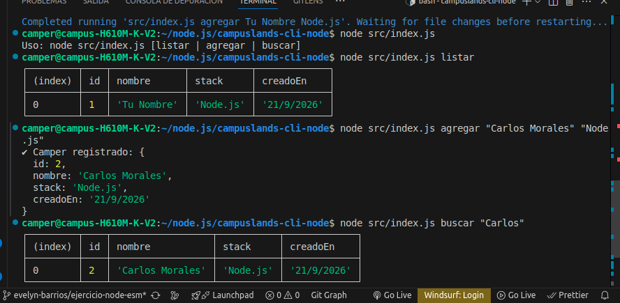

#  EXPLICACIÓN DEL CODIGO Y EVIDENCIAS 

#  Campuslands CLI - Gestión de Campers

Autor: Evelyn Noemí Barrios Méndez

> Aplicación de consola (CLI) desarrollada en **Node.js** utilizando módulos nativos de **EcmaScript (ESM)** para la gestión y control de campers, con persistencia local en formato JSON.

---

## 🚀 Características Principales

* **100% ESM Nativo:** Configurado con `"type": "module"` en Node.js, utilizando rutas absolutas seguras (`fileURLToPath`) e importaciones limpias.
* **Persistencia de Datos:** Almacenamiento local automático en un archivo JSON (`data/campers.json`).
* **Interfaz de Consola Interactiva:** Salida de datos formateada en tablas profesionales mediante `console.table()`.
* **Manejo de Errores Robusto:** Control de argumentos faltantes, excepciones en bloques `try...catch` y validación de archivos vacíos.

---

## 📂 Estructura del Proyecto

```text
├── data/
│   └── campers.json      # Base de datos local (JSON)
├── src/
│   ├── campers.js        # Lógica de negocio y persistencia (File System)
│   ├── index.js          # Enrutador de comandos de la consola CLI
│   └── interactivo.js    # Módulo interactivo con node:readline (Opcional)
├── package.json          # Configuración y dependencias del proyecto
└── README.md             # Documentación oficial
